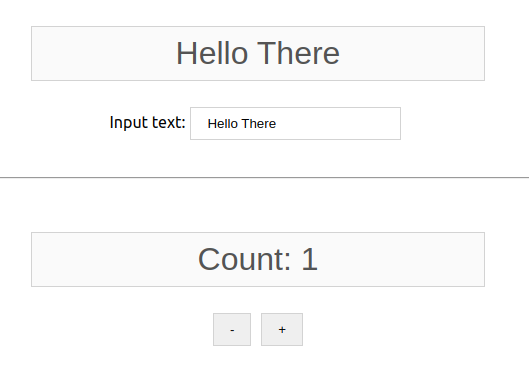

<h1>React's Data Props/States</h1>

Handling and sharing two-way data binding between components through the use of props/states.

<h3>Result:</h3>

<h3>Description:</h3>

Passing data ("Hello there") from the parent to the component child and updating the value on the parent form the component child.

`Parent component > Child component > Parent component`

This demo also updates a counter on the parent component by clicking on the counter component.
