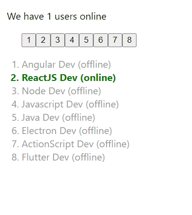

<h1>React's Hooks - useLayoutEffect</h1>

Re-render call using useLayoutEffect (React 16.8+)

Same implementation of [useEffect](../react-hooks-useeffect/) hook project but using [useLayoutEffect](https://beta.reactjs.org/reference/react/useLayoutEffect) that renders before react loads the page.

External Official References:

- [useEffect](https://beta.reactjs.org/reference/react/useLayoutEffect)

- <a href="https://beta.reactjs.org/reference/react/useLayoutEffect" target="_blank">useLayoutEffect</a>
