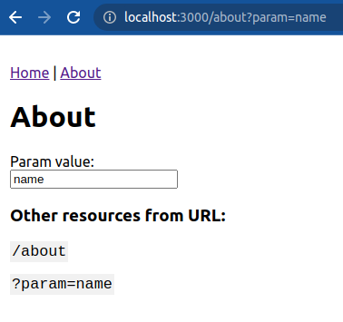

<h1>React Route</h1>

Lazy loading feature implementation, routing, and getting data from URL.

---

---

<h5>Additional Library:</h5>

- [react-router-dom](https://www.npmjs.com/package/react-router-dom)
